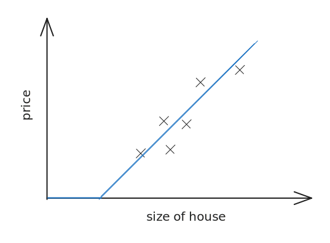

# Week 1

## Neural network

Let's see what exactly a neural network is. Let's consider an example on houring price prediction.

So suppose we have the data of 6 houses along with their prices and we're going to use it to make a machine learning model.

Now in machine learning, we would simply plot a line in the graph using some like linear regression. _Let's plot it in the above example._

Now we have drawn a simple blue linear line that can work pretty well on the above dataset.&#x20;

But heyyy, wait! Price can-not be negative, atleast in our case, it seems illogical to sell a house at negative price. So to fix that, we'll put a simple straight line at the x-axis so that the blue line can never go below x-axis.

Now if you see closely, you would see, we have built a simple machine learning model. But in fact, this is also a deep learning model.&#x20;

And as you can see, this is our neural network, basically a single perceptron for our dataset. In fact, the function we used above is very widely used in deep learning and is known as [**ReLU**](#user-content-fn-1)[^1]**.**

In the above example, we had nothing but house size. But suppose, now we have a lot more information about the house, in such cases, we create a more complex neural network like below.

## Supervised learning

Supervised learning is basically training a deep learning (or machine learning) model on a data, which has all the labels including the target label.

It can be done in any of the way.

### Structured data

A data that is in more of a tablular format.

### Un-structured data

Some data like images, audios or something else that is not structured properly.

[^1]: Rectified Linear Units
